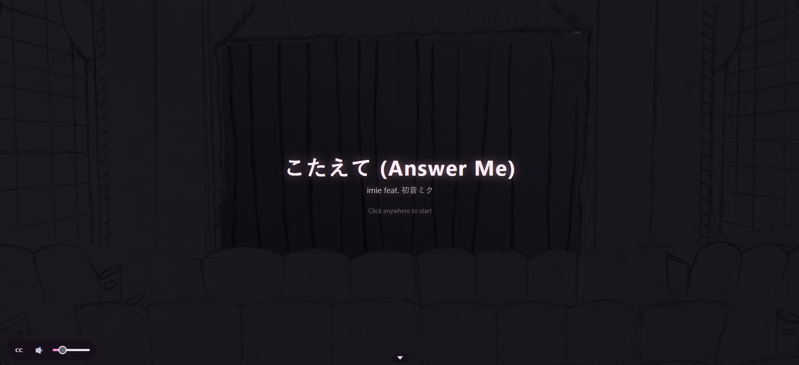
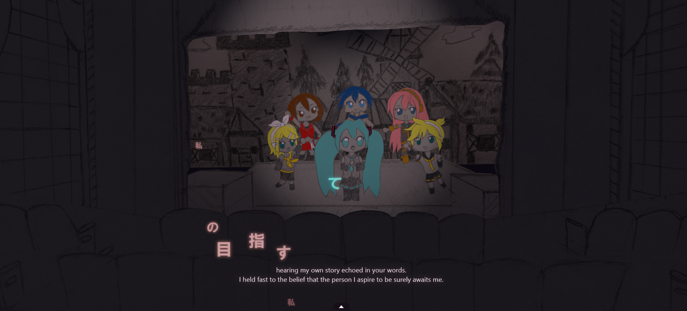

# こたえて — A Magical Mirai 2026 lyric visualizer

A web-based lyric performance for the [Hatsune Miku「Magical Mirai」2026
Programming Contest][procon], built on the contest's Grand Prize song
**imie feat. 初音ミク —「こたえて」(Answer Me)**.

All graphics are hand-drawn! And lyrics rise out of the audience as glowing characters
onto a pop-up-storybook stage, where Hatsune Miku and the Crypton cast — Kagamine Rin,
Kagamine Len, Megurine Luka, Meiko, and Kaito — sway, bob, and spin with the music under a live spotlight.

By **Tylon Guan** · ### (◕‿◕) Hello from the USA 🇺🇸 (◕‿◕)

### Demo can be found here! https://miku-stage.vercel.app/

<p align="center">
  
  
</p>

---

## For the judges (60-second orientation)

| Judging axis | Where to look |
|---|---|
| **Aesthetic** — does it move beautifully with the music? | Every layer is **original graphite art** drawn for this entry; lyrics, Miku, the chorus, the curtains and spotlight are all animated per-character to the TextAlive timing. See **[The concept](#the-concept)**. |
| **Innovation** — is the idea novel? | Lyrics **emerge from the audience** rather than overlaying the screen; a **ref-driven per-frame signal bus** animates the whole scene without a single React re-render; tempo-locked performer motion, gyroscope tilt, and a CSS-style **style cascade**. See **[Under the hood](#under-the-hood)**. |
| **Completeness** — does it run cleanly and well? | Static build, no server. **Runs in ~2 minutes** (below). TypeScript strict, `npm run typecheck` is green, works on PC / tablet / phone. See **[Quick start](#quick-start-run-in-2-minutes)**. |

**Reading the code?** Start at [`src/App.tsx`](src/App.tsx) → [`src/scene/Scene.tsx`](src/scene/Scene.tsx)
→ [`src/scene/Signals.tsx`](src/scene/Signals.tsx). The
[Architecture](#architecture--data-flow) section traces the data flow.

---

## Quick start (run in ~2 minutes)

**Prerequisite:** Node.js ≥ 18. (No accounts, keys, or backend — the TextAlive
token is bundled in `src/config.ts`.)

```bash
npm install

# Option A — development server with hot reload:
npm run dev          # → https://localhost:1234

# Option B — production build, then serve the static bundle:
npm run build        # → emits the static site to dist/
npx serve dist       # → serves it at http://localhost:3000
```

Open the URL, **click anywhere to start**, and the song plays. That's it — there
is no server-side component; `dist/` is a self-contained static bundle that runs
from any HTTP server or static host with no configuration.

> **On a phone/tablet?** iOS only enables the gyroscope over **HTTPS**, so to
> exercise the device-tilt camera use `npm run dev:mobile` (serves HTTPS on
> `0.0.0.0:1234`) and open `https://<your-LAN-IP>:1234`, or tunnel a build
> (`npx cloudflared tunnel --url http://localhost:3000`). On desktop you can fake
> it with Chrome DevTools → **Sensors** → *Orientation*. Everything else works
> over plain HTTP.

```bash
npm run typecheck    # tsc --noEmit — the project's verification gate (no test suite)
```

---

## The concept

This project is staged as a small live performance **witnessed from inside a
hand-drawn pop-up storybook**. Every piece from the back wall, the
backdrop, the stage floor, the proscenium and curtains, the audience seats, and
the star characters themselves Hatsune Miku, Kagamine Rin, Kagamine Len, Megurine Luka, Meiko, and
Kaito, were all drawn as **original graphite-pencil illustrations** that were then photo-scanned and
digitised by me!

The inspiration for this project came from the **Miku Expo 2024 and 2026** shows I've attended.
The stage here is a nod to the venue I stood in — the **Boch Center – Wang Theatre
in Boston** — and I wanted to recapture the feeling of watching the show unfold
from the audience.

My main skillset is programming and my art skills, even as a hobby, are limited, and so I leaned into
that constraint and chose a **paper pop-up-book style**. To me, it fit the song well:
*"Answer Me"* by imie has a festive, almost medieval tone which reminded me of a storybook feeling. The kind you'd might find in an fairytale book.

For the design of the lyrics:

- **Lyric colour follows the singer.** Since Miku sings most of the song, so had her lines
  glow **teal**. For the supporting parts I could only make an educated *guess* on who was singing
  (and "dancing").
  So instead of mixng all the cast's colors to make a brown I choose **pink** as a nod to another
  festive character, Sakura Miku. 
- **Active words highlight like in karaoke.** The words being sung gets brightens
  into a bold, saturated colour. Another inspiration from my karaoke experiences.
- **Lyrics rise and drift away like light sticks.** At Miku Expo, fans wave their light
  sticks to the rhythm and switch their colour to match the singers on stage. In my opinion, the
  most memorable parts are the slow sections of the performace, where the whole crowd raises their
  sticks in unison. It gives a wholesome vibe, and usually its right before the climax of the show.
  The glyphs flying up out of the audience and settling into a glowing line are my attempt to kind of
  capture that moment.

In the finished piece you can move the camera and zoom in and out to watch a
**2.5-D theatre** of Miku and the Crypton cast perform the Grand Prize song,
*imie feat. 初音ミク —「こたえて」(Answer Me)* — my attempt to share a bit of what
I felt at Miku Expo. I put real emphasis on multi-platform support so anyone,
anywhere can experience it. I hope you enjoy it!

Everything you see, from the lyrics to the characters, is **synchronised to the
music** through the [TextAlive App API][textalive], which supplies per-character
lyric timing plus beat, chord, vocal-amplitude, and chorus-segment analysis. Each
kanji has its own flight path, each performer's dance is locked to the syllable
they're singing, the cast twirls on and off stage on cue, and a confetti of
falling stars showers the final chorus.

---

## Under the hood

The novelty is as much in *how* this runs as in how it looks. A few of the harder
problems it solves:

- **60 fps with zero React re-renders.** Pushing a whole animated scene through
  React's render cycle would stutter. Instead, [`Signals.tsx`](src/scene/Signals.tsx)
  writes **one shared, mutable `Signals` object** each frame (position, colour
  saturation, climax, beat pulse, continuous beat count, vocal amplitude, chorus
  flag); every component reads it through a ref inside `useFrame` and mutates
  three.js objects directly — so the music animates the scene every frame
  **without ever touching React state**.
- **Staying in sync after a seek.** TextAlive's Songle timer goes stale the moment
  you scrub. The fix: read the *true* clock straight from the `<audio>` element
  TextAlive injects, so a glyph's timing is right even immediately after a seek.
- **Repairing broken lyric timing.** TextAlive's per-character timing for the
  parallel-voice pre-chorus collapses to ~1 ms, flashing the whole line at once.
  Hand-authored timing overrides (keyed by phrase text and merged in
  [`buildLyrics.ts`](src/textalive/buildLyrics.ts)) restore a singable cadence.
- **Motion locked to the beat, not the clock.** A wall-clock timer drifts against
  the song. Instead the sway period is driven by a **continuous beat count**, and
  each character gets a self-contained **bob pulse** (rise → hold → fall) per
  syllable — long held notes visibly hold, quick syllables blip. Miku and the
  chorus share the same maths
  ([`performerMotion.ts`](src/scene/performers/performerMotion.ts)) so they move
  in unison.
- **The 2.5-D pop-up illusion.** Flat scanned drawings are layered into a stage by
  turning **depth-testing off** and painting purely by `renderOrder`, so a
  physically-farther plane can still draw on top — exactly how a paper pop-up
  stacks.
- **Lyrics that wrap but never rescale.** Word-wrap is measured against a **fixed
  reference FOV**, so zooming reveals more of the art instead of shrinking the
  text; line breaks fall only on word boundaries — important for Japanese, which
  has no spaces.
- **Casting the show by ear.** TextAlive gives you the words, not the singer. A
  hand-authored **casting cue timeline** (entrances, exits, staggered one-by-one
  spin-outs) plus a per-phrase singer map decide who's on stage and who bobs vs.
  sways.
- **A CSS-style style cascade.** Per-glyph styling resolves through
  `globalDefaults → song → phrase → word → char` (closest wins), so any single
  moment can be re-coloured or re-animated by data alone — no per-song code.
- **Multi-platform from the start.** Gyroscope tilt is remapped into screen space
  across portrait and both landscapes; the subtitle reflows to the top on phones
  (in either orientation) so it never covers the lower-mid lyric band; the in-app
  volume slider is desktop-only (touch devices use their hardware buttons, which
  also sidesteps iOS Safari's read-only media volume); and a device-pixel-ratio
  cap plus a Bloom toggle keep the fill-rate-bound rendering smooth on phones. *(iOS gyro caveat: the motion sensor needs **HTTPS** or
  `localhost`; a plain-HTTP build served by LAN IP — e.g. `npx serve dist` on a
  phone — shows no permission prompt and tilt stays off. Serve over HTTPS to
  enable it; see [Quick start](#quick-start-run-in-2-minutes).)*

---

## Features at a glance

- **Per-character lyric animation** with entry/settle/exit phases, per-phrase
  timing corrections for the parallel-voice chorus, and responsive word-wrap.
- **Sketchbook theatre stage** — five depth-tinted, parallaxed graphite layers.
- **Curtains** that part on play and close on song end.
- **Spotlight with fade-in** — a real `THREE.SpotLight` plus a separate
  background wash constrained (via a render layer) to light only the backdrop.
- **Miku animation** — syllable-locked bob, continuous sway, chorus-entry spin.
- **Rotating chorus ensemble** — Rin, Len, Luka, Meiko, Kaito enter and exit on a
  cue timeline, twirling in/out, bobbing only on the lines they actually sing.
- **Climax confetti** — an instanced star shower through the final chorus.
- **English subtitles** — a per-phrase translation gloss shown in sync, with a
  **`CC` on/off toggle** (switchable before or during the song) and a responsive
  position that moves to the top on phones so it never covers the lyrics.
- **Playback controls** — scrub bar, volume, mute, the subtitle toggle, keyboard
  shortcuts (Space / ←·→), and a collapsible control bar.
- **Bloom + tunable house lights**, both exposed for readability across displays.

---

## Tech stack

| | |
|---|---|
| Framework | React 18, TypeScript (strict) |
| 3D | three.js, @react-three/fiber, @react-three/drei |
| Post-processing | @react-three/postprocessing (Bloom) |
| Music / lyric API | [TextAlive App API][textalive] |
| Dev tuning | leva (hidden in production builds) |
| Build | Webpack 5 + Babel → static `dist/` |

---

## Architecture & data flow

```
TextAlive Player ─(onVideoReady)─▶ buildLyrics() ─▶ LyricData {chars, phrases}
        │                                                  │
        │ (per frame, in <SignalsUpdater>)                 ▼
        └─ analysis.ts helpers ─▶ Signals {pos,sat,clim,beat,vocal,chorus,…}
                                          │
                  every scene component reads signalsRef each frame (no React state)
```

- **`usePlayer.ts`** owns the TextAlive `Player`, playback state, and the
  `controls` object.
- **`buildLyrics.ts`** flattens TextAlive's phrase→word→char lists into a flat
  `CharDatum[]` with a baked entry→settle→exit journey per glyph.
- **`Signals.tsx`** writes the one shared per-frame `Signals` object (the core
  pattern above).
- The scene components (`Theater`, `Curtains`, `Miku`, `Chorus`, `Lyrics`,
  `Stars`, `Spotlight`, …) each read `signalsRef` and animate three.js objects
  directly.

### Project layout

```
src/
  App.tsx                  — root: player hook + <Canvas> + <Overlay>; input + shortcuts
  config.ts                — song IDs, TextAlive token, English translation
  index.tsx                — React mount
  styles.css               — DOM-layer styling (overlay, controls, subtitle, hint)
  scene/                   — the 3D scene, grouped by domain
    Scene.tsx              — scene composition + Bloom + ambient control
    Signals.tsx            — per-frame shared signal computation
    stageMetrics.ts        — shared projection + camera-framing constants
    common/                — color.ts · ease.ts · sketch.ts (HSL / easing / paper-sprite)
    backdrop/
      Theater.tsx          — five parallaxed sketch backdrop layers
      Curtains.tsx         — drapes that part on play / close on song end
    performers/
      Miku.tsx             — Miku sprite + bob/sway/spin
      Chorus.tsx           — the Crypton ensemble (consumes the casting compiler)
      performerMotion.ts   — shared bob-pulse + tempo-locked sway maths
    lighting/
      Spotlight.tsx        — real spotLight with fade-in on first play
      BackgroundLight.tsx  — stage-wash lights for the backdrop (layer-gated)
    camera/
      CameraRig.tsx        — orbit-on-drag + zoom + gyroscope tilt
      gyro.ts              — device-orientation input singleton (mobile)
    effects/
      Background.tsx       — atmospheric petal particles + clear-colour wash
      Stars.tsx            — instanced falling-star confetti for the climax
    lyrics/
      Lyrics.tsx           — glyph sprites + the per-frame orchestration loop
      glyphAnimation.ts    — per-glyph lifecycle / position / opacity / colour (pure)
      wordWrap.ts          — responsive multi-line word-wrap layout (pure)
      styleCascade.ts      — cascade resolver (defaults → song → phrase → word → char)
      lyricStyleDefaults.ts — global default lyric style
      glyphTexture.ts      — cached canvas glyph textures (system fonts)
      types.ts             — style override types + SongConfig
      casting/compile.ts   — casting-cue → on-stage-interval compiler (pure)
      songs/answerMe/      — this song's config + chorus timing corrections
  textalive/
    usePlayer.ts           — TextAlive Player React hook
    buildLyrics.ts         — flattens phrases/words/chars into renderable data
    analysis.ts            — beat / vocal / chorus signal helpers
    types.ts               — lyric data types
  ui/
    Overlay.tsx            — HTML transport controls + subtitle + gesture hint
art/
  Theater/                 — graphite-pencil theatre backdrop layers (PNG)
  MikuCutout/              — hand-drawn Miku poses with transparent BG
  RinCutout/ LenCutout/ LukaCutout/ MeikoCutout/ KaitoCutout/ — chorus cutouts
```

---

## Contest compliance

This entry is built to the [contest rules][procon]:

- **No AI-generated assets.** All artwork — the theatre layers and every
  character cutout — is **original graphite illustration drawn by hand** for this
  entry by Tylon Guan and digitised; none is reused from existing piapro / fan
  art or produced by an image generator. The song is the licensed contest track
  (below). The English subtitles are a **translation of the Japanese lyrics**,
  which the rules explicitly permit ("Usage for translation purposes is
  permitted").
- **Static web application, no server.** The build emits plain HTML/CSS/JS to
  `dist/` with relative paths; there is no PHP/Ruby/Node backend and no
  server-side dynamic response. It runs from any static host.
- **Runs on PC, tablet, and smartphone** browsers (responsive layout, touch +
  pointer + gyro input).
- **Readable, non-obfuscated source** with build scripts included (Webpack).
- **Official song data.** The TextAlive analysis IDs (`beatId`, `chordId`,
  `repetitiveSegmentId`, `lyricId`, `lyricDiffId`) in `src/config.ts` are the
  values published at the [contest event page][procon].
- **PCL-compliant, non-commercial** use of the Crypton Piapro Characters —
  Hatsune Miku and the rest of the cast (below).

---

## Credits & Attribution

### Song

**「こたえて」(Answer Me)** — composed and produced by **imie** featuring vocals
by **初音ミク (Hatsune Miku)**. Published on piapro:
<https://piapro.jp/t/6W2N/20251215164617>

### Characters

All six performers are Crypton Future Media's **Piapro Characters** — **初音ミク
(Hatsune Miku)**, **鏡音リン (Kagamine Rin)**, **鏡音レン (Kagamine Len)**, **巡音ルカ
(Megurine Luka)**, **MEIKO**, and **KAITO** — developed and licensed by **Crypton
Future Media, INC.** Their character art is by **KEI** (Hatsune Miku, the Kagamine
twins, and Megurine Luka) and **iXima** (MEIKO and KAITO).

> © Crypton Future Media, INC. [www.piapro.net](https://piapro.net)

Used under the [Piapro Character License (PCL)][pcl]. This project is a
non-commercial entry in the Magical Mirai 2026 Programming Contest.

### Lyric & audio analysis

**TextAlive App API** — developed by the National Institute of Advanced
Industrial Science and Technology (AIST) and contributors. Beat, chord,
vocal-amplitude, and chorus-segment data is supplied by the TextAlive analytical
pipeline (Songle). <https://developer.textalive.jp/>

### Artwork

All theatre backdrop layers (back wall, stage floor, curtains/proscenium,
audience seats) and the character cutouts are **original graphite illustrations**
drawn for this entry by Tylon Guan and digitised. They are not reused from
existing piapro / fan art.

### Special Thanks!

Thank you for all my friends and family who supported and motivated me 
during the development of this project.
- Stiven G. S.
- Stephen B.

---

## License

Source code in this repository is released under the **MIT License** (see
`LICENSE`) **with the following exceptions**:

- The **original graphite artwork** in `art/` is the author's own work,
  © 2026 Tylon Guan, all rights reserved. It is provided for the contest entry
  and may not be redistributed separately.
- All uses of the **Crypton Piapro Characters** (Hatsune Miku, Kagamine Rin / Len,
  Megurine Luka, MEIKO, and KAITO) are governed by the
  [Piapro Character License][pcl] and the surrounding Crypton terms — those terms
  supersede this repository's licence wherever they apply.
- The **TextAlive App API** is subject to its own terms of service.

If you fork or build on this project, replace `TEXTALIVE_TOKEN` in
`src/config.ts` with your own developer token and make sure your use is
PCL-compliant.

[procon]: https://magicalmirai.com/2026/procon/index_en.html
[textalive]: https://developer.textalive.jp/
[pcl]: https://piapro.net/intl/en_for_creators.html
